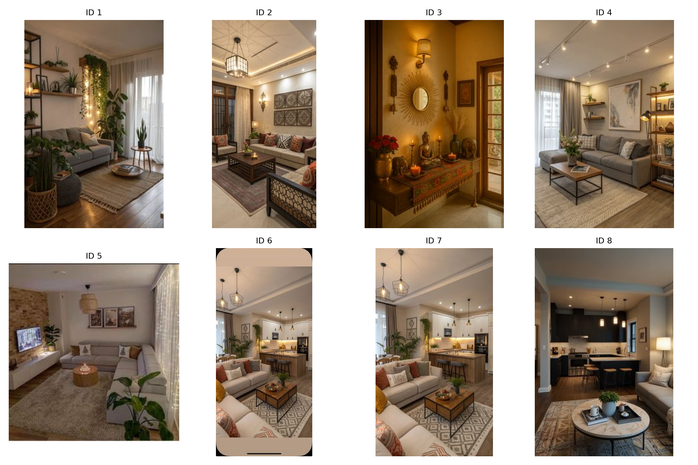

<p align="center">
  
</p>

# 📊 AWS Pinterest Image Analytics Pipeline

## **End-to-End Computer Vision & Cloud Integration Project**
---

## **🎯 Project Overview**

This project implements a complete end-to-end image analytics pipeline using:

- **AWS SageMaker**
- **AWS Rekognition**
- **ImageAI (YOLOv3)**
- **Google Firebase Firestore**
- **Python (Pandas, Requests, Boto3)**

The objective was to scrape Pinterest images, analyze them using both cloud-based and local computer vision models, compare the outputs, and store structured results in a scalable cloud database.

This project demonstrates cloud AI integration, object detection, data engineering, and business analytics thinking.

---

## **📁 Dataset Description**

The dataset consists of:

- 75 scraped Pinterest images
- Metadata including:
  - Pin URL
  - Image URL
  - Board/topic
  - Engagement metrics
  - Notes on visual appeal

Primary dataset file:

- `pinterest_scraped_dataset.xlsx`

A gallery preview of scraped images:

## **📸 Sample Scraped Images**


The dataset mainly includes indoor home décor images featuring plants, sofas, books, warm lighting, and furniture arrangements.

---

## **1️⃣ AWS Rekognition – Image Labeling (Q3)**

### **Approach**

- Selected 20 images from the scraped dataset
- Downloaded image bytes dynamically
- Used AWS Rekognition `detect_labels()` API
- Extracted:
  - Top label
  - Confidence score
  - Labels above 90% confidence threshold
- Exported structured CSV results

Output file:

- `aws_rekognition_image_labels.csv`

### **Key Characteristics**

- Cloud-based
- Fast and scalable
- Returns scene-level labels
- No bounding boxes (in this implementation)
- Structured and clean output

### **Example Output**

- Architecture – 100%
- Indoors – 99.99%
- Home Decor – 99.99%

---

## **2️⃣ ImageAI (YOLOv3) – Object Detection (Q4)**

### **Approach**

- Processed all 75 images
- Used YOLOv3 model weights
- Detected multiple objects per image
- Extracted:
  - Object name
  - Confidence score
  - Bounding box coordinates
- Saved annotated images
- Exported structured CSV with 363 detections

Output file:

- `yolov3_object_detection_results.csv`

### **Top Detected Objects**

- Potted plants
- Books
- Sofas
- Chairs
- Vases

This aligns strongly with the indoor décor theme of the dataset.

### **Strengths**

- Multiple object detection
- Bounding box localization
- Rich visual output
- High interpretability

---

## **3️⃣ Model Comparison (Q5)**

### **Similarities**

- Both methods classify image content
- Both export structured CSV results
- Both provide confidence scores

### **Differences**

| AWS Rekognition | ImageAI (YOLOv3) |
|-----------------|------------------|
| Cloud-based | Local processing |
| Scene-level labeling | Object-level detection |
| Faster setup | More detailed output |
| No bounding boxes | Bounding boxes included |
| Scales easily | Slower and resource-heavy |

### **When to Use Which**

- Use **Rekognition** for large-scale production classification
- Use **ImageAI** when detailed object positioning is required
- Use **GenAI tools** for natural-language scene description (not structured analytics)

---

## **4️⃣ Firebase Firestore Integration (Q7)**

All datasets were uploaded to Google Firebase Firestore:

Collections created:

- `q1_pins`
- `q2_followers`
- `q3_rekognition`
- `q4_imageai`
- `q6_color_style`

Each row of analysis results was stored as a document in Firestore.

### **Benefits**

- Cloud storage scalability
- Real-time querying
- Structured document model
- Easier future integration with web applications

---

## **5️⃣ Business Recommendations (Q8)**

Based on visual analytics and engagement patterns:

### **Findings**

- Indoor décor images with plants and warm lighting drive strong engagement
- Multiple objects in cozy layouts correlate with saves and reactions
- Visual consistency matters

### **Recommendation**

Pinterest could implement:

- AI-powered “See in My Room” feature
- AR-based object placement
- Palette-aware product recommendations
- Video-first interactive discovery flow

This would convert inspiration into purchase with higher engagement and reduced friction.

---

## **📊 Technologies Used**

- Python
- Pandas
- Boto3
- AWS Rekognition
- AWS SageMaker
- ImageAI (YOLOv3)
- Google Firebase Firestore
- Requests
- PIL
- JSON processing

---

## **🧠 Technical Highlights**

- Dynamic image downloading
- Cloud API integration
- Confidence threshold filtering
- Bounding box extraction
- One-row-per-object structured CSV generation
- Batch upload to Firestore
- Scalable cloud pipeline design

---

## **📂 Repository Structure**

```
01_AWS_Rekognition_Image_Labeling.ipynb
02_ImageAI_Object_Detection_and_Firebase_Pipeline.ipynb

pinterest_scraped_dataset.xlsx
aws_rekognition_image_labels.csv
yolov3_object_detection_results.csv
image_color_style_analysis.csv

pinterest_image_gallery_preview.png
README.md
```

---

## **👤 Author**

**Nicky Kumari**  
Cloud Analytics | Computer Vision | Data Engineering | AI Integration
